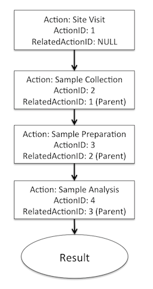
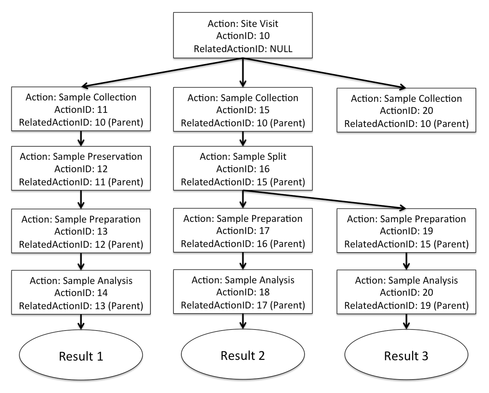
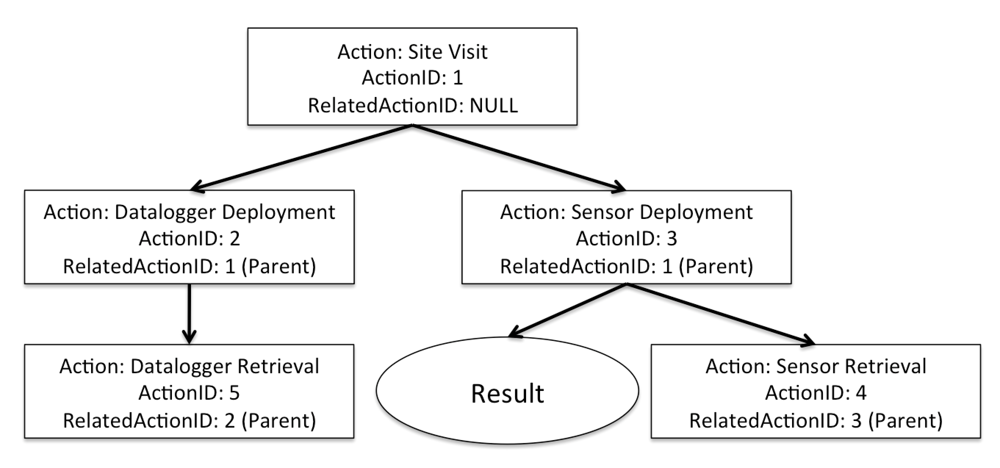
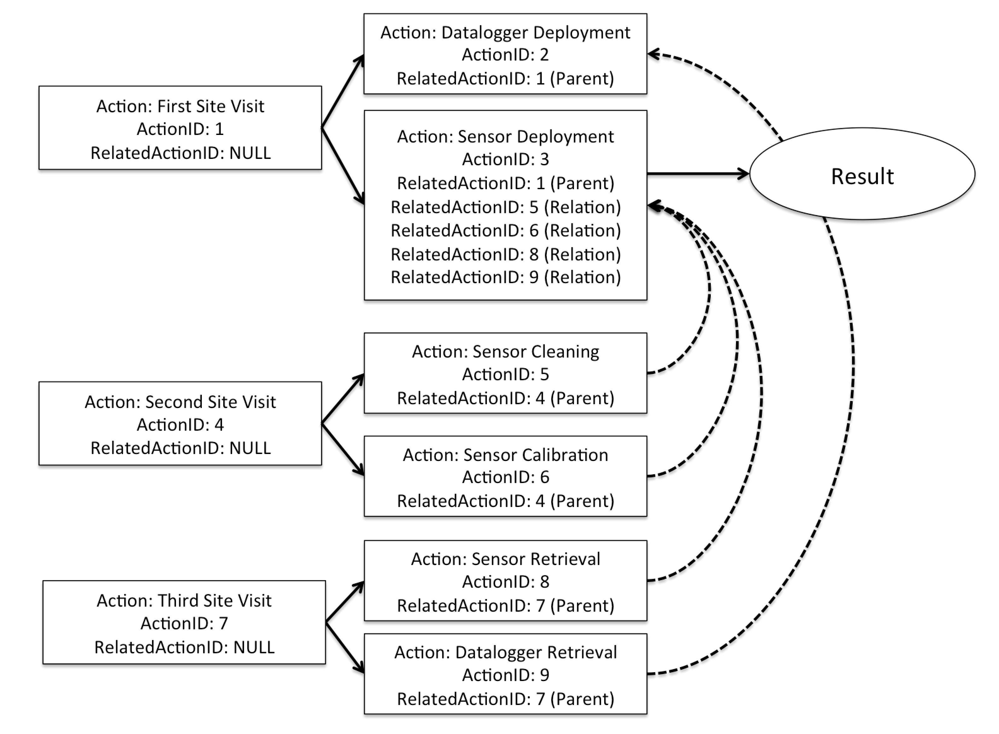

ODM2 Core: Related Actions
==========================

In many cases, observations result from several related Actions. These Actions may occur in a linear sequence (e.g., a workflow). In other cases, Actions may occur that are outside of a linear workflow sequence, but that are related to the Action that creates a Result. In some cases, the interpretation of a Result requires knowing the entire sequence of Actions that led to the Result and the Methods used to perform those Actions.  For example, two separate laboratory analyses could be performed on a single sample using the exact same analytical method. These separate analysis Actions may produce very different Results if a different sample preparation or extraction Action was performed on the sample before each analysis was run. 

ODM2 users have two options for describing what could be considered to be "composite" methods - that is, procedures that are made up of multiple Actions.

1. Create a single, "composite" Method that is a narrative of all of the Actions performed. This single Method would then be used with a single "Observation Action" that is linked to the Result.
2. Create a series of Actions that are recorded separately, each with thier own granular Method description. The relationships among the actions are then recorded in the RelatedActions entity.

Sequencing of and relationships between Actions can be specified in the RelatedActions entity, and the order of Actions can then be traversed by following the sequence of Actions. Examples of of how to use the RelatedActions entity follow.

### Simple Sample Example

1. A site visit is conducted (ActionID = 1)
2. A sample is collected in the field as part of the site visit (ActionID = 2)
3. The sample is prepared for analysis in the laboratory (ActionID = 3)
4. The sample is analyzed in the laboratory to obtain a result (ActionID = 4)

In this linear workflow, the Result can be linked all the way back to the site visit Action during which the sample was collected. Each Action is linked to its parent through a RelatedActionID. The nature of the relationships among the Actions would be recorded in the RelationshipType field in the RelatedActions entity. In this example, the RelationshipType for all of the relationships is expressed as "Parent," indicating that in each case the related Action is the immediate parent of the current Action.

### Complex Sample Example

1. A site visit is conducted (ActionID = 10)
2. Multiple samples are collected in the field (ActionID = 11, 15, and 20)
3. One of the samples is preserved in the field (ActionID = 12). The others are not.
4. One of the samples is split in the laboratory (ActionID = 16)
5. Each of the samples/subsamples is subjected to a preparation procedure (ActionID = 13, 17, and 19)
6. Each of the samples/subsamples is analyzed using a laboratory analytical method (ActionID = 14, 18, 20) producing a result

This example involves a hierarchy of Actions that all originate from a single visit to a monitoring site.  There are actually multiple linear workflows within this example, where a workflow is a path from the first Action (the site visit) to an independent Result. There is also a partial workflow where a sample was collected but then no further Actions were taken.

In this example, even though each of the samples may have been collected at the same location and time, each of the Results may be very different because the sample preservation and preparation Actions are different. However, as in the previous example, each of the Results can be traced all the way back to the site visit during which the samples were collected by tracing up the heirarchy using each Action's immediate parent. 

### Simple Sensor Example

1. A technician visits a monitoring site (ActionID = 1)
2. The technician configures and deploys a datalogger (ActionID = 2)
3. The technician configures and deploys a sensor to obtain a Result (ActionID = 3)
4. The technician retrieves the datalogger and sensor, ending data collection (ActionID = 4 and 5)

This simple sensor example implies that during a single site visit Action a technician deploys a datalogger and sensor, generating a time series Result. During that same site visit, the technican then retrives the sensor and datalogger, ending data collection. This scenario would fit short duration sensor deployments, but will not cover sensor deployments that span multiple site visits. The following example describes how more complex sensor deployments can be represented.

### Complex Sensor Example

More often, deployment of in situ sensors involves ongoing data collection, and additional site visit Actions will be required over time for sensor cleaning, maintenance, and calibration. Additionally, other field Actions such as manual stage readings or discharge measurements may be performed as part of subsequent site visits. Representing the sequence of Actions related to a sensor deployment and Result involves potentially multiple separate heirarchies of Actions, all of which must be related to the initial sensor deployment (because the sensor deployment is the Action to which the Result should be linked).  For example:

1. The technician completes steps 1-3 in the simple sensor example above (ActionID = 1, 2, and 3)
2. The technician performs a separate site visit (ActionID = 4)
3. The technician cleans the sensor (ActionID = 5)
4. The technician calibrates the sensor (ActionID = 6)
5. The technician performs another separate site visit (ActionID = 7)
6. The technician retrieves the datalogger and sensor, ending the deployments and data collection (ActionID = 8 and 9)

This example demonstrates that not all relationships among Actions will be simple parent/child relationships that result in linear workflows. Instead, multiple types of relationships are required, which is why the RelatedActions entity contains the RelationshipType attribute. A user wishing to retrieve all activities related to the sensor deployment that created a time series Result would not only get the relationship with the site visit during which the original deployment was created, but also all subsequent Actions that have been related (e.g., sensor cleaning and calibration activites or any other activies for which a formal relationship has been created). For display purposes, these Actions could be 
