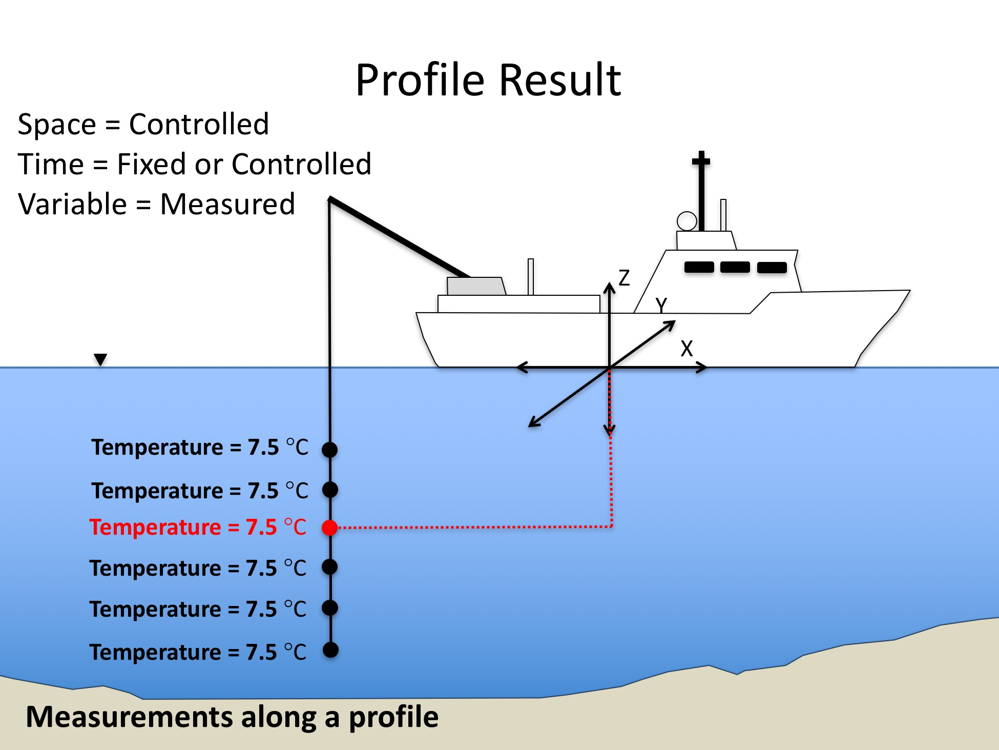

ODM2 Extensions: Results - Depth Profile Coverage Result Type
===========================================================

An **Depth Profile Coverage** Result consists of a series of ResultValues for a single Variable, at a single location, measured using a single Method, with specific Units, having a specific ProcessingLevel, but measured over multiple depths. In many cases, a **Depth Profile** will Result from deployment of one or more sensors, but it may also result from a series of Specimens taken at multiple depths and later analyzed in a laboratory. The following are the details of the measurement framework for a Depth Profile Coverage Result.

**Table 1**. Depth Profile Coverage Result measurement framework.

| **Component** | **Role** | **Description** |
| :------------ | :------- | :-------------- |
| Space         | Controlled | A Depth Profile is generally located at a Site (X and Y are fixed), but individual ResultValues within the profile are measured at controlled depths (Z is controlled).  Depths are measured relative to some datum or origin (e.g., water surface, soil surface, well head elevation, etc.). There may be an intended vertical spacing for the ResultValues. |
|Time           |Fixed or Controlled | Depth profiles may be collected instantaneously (e.g., from a string of sensors that all sample simultaneously in time) or over time (e.g.,  where an instrument is dropped from the top of a profile to the bottom over time). In the case where time is controlled, Depth Profiles may have an intended temporal spacing that indicates the intended time spacing with which the ResultValues will be recorded. Actual temporal spacing is inherent in the  ValueDateTime recorded with each ResultValue. Temporal spacing and support are controlled by the sensor or logger that records the measurement or, in the case of a profile of samples, by the apparatus or Method that collects the samples. |
|Variable       |Measured   | ResultValues represent measurements of a Variable at each depth within the profile. ProcessingLevel, Units, Status, and SampledMedium are the same for every ResultValue in the Depth Profile Result. |

Each ResultValue within a Depth Profile Coverage is a floating point number. The following is an example of a Depth Profile Coverage Result:

A Depth Profile Coverage observation of "Temperature" (Variable) at "Puget Sound Site 1" (SamplingFeature) measured using a "YSI 6000 Series Sonde" (Method) on "2014-03-31" (ValueDateTime) had ResultValues and Units:

| **Depth Z (m)** | **ResultValue (Deg. C)** |
| :-------------- | -----------------------: |
| 0.5 | 10.0 |
| 1 | 9.8 |
| 1.5 | 9.7 |
| 2.0 | 9.6 |
| 2.5 | 9.5 |
| ... | ... |

**Figure 1**.  Depth Profile Result example.

### Spatial Offset for Depth Profile Results
In the measurement framework for a depth profile Result, the X and Y locations are fixed, whereas the Z location (i.e., depth) varies. Each ResultValue for a profile result must have a recorded ZLocation and Units. It is possible to have an X and Y spatial offset for a depth profile Result, but the X and Y coordinates, which would be given by XLocationa and YLocation in the ProfileResults entity are fixed for every value in the depth profile.

### Spatial Aggregation for Depth Profile Results
In a depth profile Result, each ResultValue that is part of the profile would have a different spatial offset (e.g., recorded depth as an instrument is lowered from the top of a water column to the bottom). In the case that an instrument is lowered to each depth and then held there for a measurement, the spatial offsets are fixed and there is no implied spatial aggregation. However, it is also possible that an instrument may be lowered continuously through a depth profile, and each recorded measurement may represent an aggregate value for a depth interval. In this case, ODM2 allows a ZAggregationInterval associated with each recorded ResultValue where the length of the interval over which the value was aggregated (e.g., the length of the depth interval) can be recorded. ZAggregationInterval values need not be equal for all recorded ResultValues in a single depth profile Result, but the IntendedZSpacing in the ProfileResults entity can be used to indicate whether there was an intention to make measurements over equally spaced depth intervals (or at evenly spaced discrete locations along the profile). It is implied that the AggregationStatisticCV attribute contains the recorded statistic for both time and space aggregations.

### Time Aggregation for Depth Profile Results
Recorded depth profile ResultValues may either be instantaneous, or they may be subject to aggregation in time. Where Specimens are collected along a depth profile, their resulting values would be instantaneous and would be associated with the time at which the Specimen was collected. Where a sensor is used, the TimeAggregationInterval and Units specify the time support over which each individual recorded RestultValue was made. For example, if a sensor is lowered to a depth and then multiple measurements measurements are made over a time interval with a resulting statistic for the interval is recorded (e.g., an average value), the time interval over which the recorded average value was measured is the TimeAggregationInterval.

