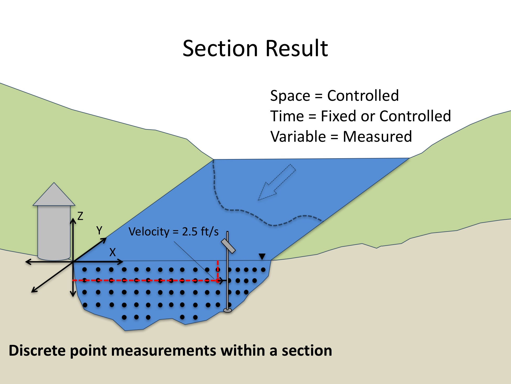

ODM2 Extensions: Results - Section Coverage Result Type
===========================================================

A **Section Coverage** Result consists of a series of ResultValues for a single Variable, measured on or at a single SamplingFeature (i.e., a cross section polygon), using a single Method, with specific Units, having a specific ProcessingLevel, but measured over varying X (horizontal) and Z (vertical/depth) locations. The ValueDateTimes associated with individual ResultValues in a Section Result may be fixed (e.g., all ResultValues within the section are the same) or controlled (e.g., where a measurements are made sequentially by moving a sensor to different locations within the section). In the case of a Section Coverage Result, the associated SamplingFeature is most likely a polygon representing a cross section (e.g., a stream cross section). Individual ResultValues are measured within the cross section, and each has associated X and Z coordinates. The following are the details of the measurement framework for a Point Coverage Result.

**Table 1**. Section Coverage Result measurement framework.

| **Component** | **Role** | **Description** |
| :------------ | :------- | :-------------- |
| Space         | Controlled | A Section Coverage Result covers a SamplingFeature that is a polygon. Y is fixed for each ResultValue, but X and Z may vary. The X and Z spacing may be consistent or variable. |
|Time           |Fixed or Controlled | Section Coverage Results may represent an instant in time (e.g., all ResultValues have the same ResultDateTime) or, each ResultValue within the Section Result may have it's own ResultDateTime (e.g., where a sensor is moved sequentially to different locations within the section).  |
|Variable       |Measured   | ResultValues represent measurements of a single Variable at each X, Z location within the Section Coverage. ProcessingLevel, Units, Status, and SampledMedium are the same for every ResultValue in the Section Coverage Result. |

Each ResultValue within a Section Coverage Result is a floating point number. The following is an example of a Section Coverage Result:

A Section Coverage observation of "Velocity" (Variable) in the "Logan River at Mendon Road" (SamplingFeature) measured using a  "Stream velocity meter" (Method) had ResultValues and Units:

| **X (ft)** | **Z (ft)** | **ResultValue (ft/s)** |
| :--------: | :--------: | :--------------------: |
| 5 | -0.6 | 1.8 |
| 10 | -0.8 | 2.43 |
| 10 | -3.2 | 1.7 |
| 15 | -1.0 | 2.63 |
| 15 | -4.0 | 1.9 |
| ... | ... | ... |

**Figure 1**.  Section Result example.

### Spatial Offset for Section Coverage Results
In the measurement framework for Section Coverage Results, the YLocation is fixed, but can be specified if needed (e.g., a stream cross section that is some distance upstream or downstream of a Site SamplingFeature).  The XLocation and ZLocation may vary for each individual ResultValue within the Section Coverage and so each recorded value must have both XLocation and ZLocation and their Units. For the example of a stream cross section, the XLocation would be the distance across the stream from one of the banks, and the ZLocation would be the depth at which the measurement was made. In the case where X and Z spacing is regular, an IntendedXSpacing and IntendedZSpacing attribute and their Units can be specified in the SectionResults entity. 

### Spatial Aggregation for Section Coverage Results
For Section Results, each ResultValue may represent a measurement at a discrete point within a cross section - in which case there is no spatial aggregation. However, spatial aggregation is possible in the X and Z directions - or both. Where aggregation is used, each ResultValue may have an X and Z interval over which it was aggregated.  The interval over which aggregation is performed can be specified by the XAggregationInterval and ZAggregationInterval attributes. Aggregation intervals are specified in the same Units as the XLocation and ZLocation attributes. Using aggregation in the X and Z directions, a cross section can be tessellated into spatial units (effectively grid cells) within which a recorded ResultValue represents an aggregated statistic. The example above shows discrete velocity measurements made at many locations within a stream cross section. Each point represents a discrete measurement and so no spatial aggregation is used.

### Time Aggregation for Section Coverage Results
Each ResultValue within a Section Coverage Result may have a time interval over which the recorded value represents an aggregation. For example, the recorded value may be an average or sum of multiple instantaneous observations made over a specific period of time, or time support. If the ResultValue represents a time aggregation, this can be specified using the AggregationStatisticCV, TimeAggregationInterval, and TimeAggregationIntevalUnitsID. Additionally, an IntendedTimeSpacing and Units can be specified in the SectionResults entity where it is desired to have a specific time spacing between recorded ResultValues.

