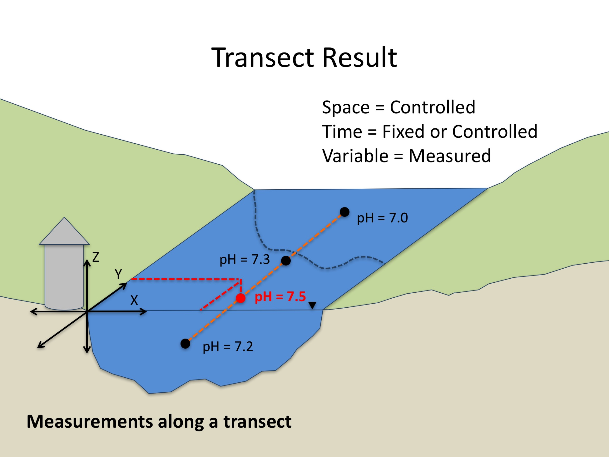

ODM2 Extensions: Results - Transect Coverage Result Type
===========================================================

A **Transect Coverage** Result consists of a series of ResultValues for a single Variable, measured on or at a single SamplingFeature (i.e., a 2-dimensional transect line), using a single Method, with specific Units, having a specific ProcessingLevel, but measured over multiple locations along a transect having varying location dimensions (e.g.,  X and/or Y, where X and Y are horizontal coordinates). ValueDateTime may be fixed (e.g., if measurements are made at all locations along a transect at the same instant in time) or controlled (e.g., where measurements are made sequentially along a transect). The following are the details of the measurement framework for a Transect Coverage Result.

**Table 1**. Transect Coverage Result measurement framework.

| **Component** | **Role** | **Description** |
| :------------ | :------- | :-------------- |
| Space         | Controlled | A Transect Coverage Result covers a SamplingFeature that is a 2-dimensional transect line. Z is fixed for each ResultValue, but X and Y may vary. The Transect line is defined by connecting the X, Y coordinate pairs. Spacing along the transect may be variable or consistent, in which case an IntendedTransectSpacing can be specified. |
|Time           |Fixed or Controlled | Transect Coverage Results may represent an instant in time (e.g., all ResultValues along the Transect have the same ResultDateTime) or, each ResultValue within the Transect Result may have it's own ResultDateTime (e.g., where a sensor is moved sequentially to different locations along the Transect).  |
|Variable       |Measured   | ResultValues represent measurements of a single Variable at each X, Y location within the Transect Coverage. ProcessingLevel, Units, Status, and SampledMedium are the same for every ResultValue in the Transect Coverage Result. |

Each ResultValue within a Transect Coverage Result is a floating point number. The following is an example of a Transect Coverage Result:

A Transect Coverage observation of "Dissolved oxygen concentration" (Variable) along the "Test stream transect" (SamplingFeature) measured using a "Hydrolab optical DO sensor" (Method) had ResultValues and Units:

| **ValueDateTime** | **XLocation (m)** | **YLocation (m)** | **TransectDistance (m)** | **ResultValue (%)** |
| :---------------: | :---------------: | :---------------: |:-----------------------: | :-------------------------: |
| 2014-03-31 12:30 PM | 0 | 0 | 0 | 9.8 |
| 2014-03-31 12:31 PM | 0 | 100 | 200 | 9.75 |
| 2014-03-31 12:32 PM | 0 | 200 | 300 | 10.1 |
| 2014-03-31 12:33 PM | 0 | 300 | 400 | 9.6 |
| ... | ... | ... | ... | ... |

**Figure 1**.  Transect Result example.

### Spatial Offset for Transect Coverage Results
In the measurement framework for Transect Coverage Results, the ZLocation is fixed, but can be specified if needed (e.g., a transect of temperature measurements, where the measurement is made 2 m above the ground at each X, Y location along the transect). The XLocation and YLocation may vary for each individual ResultValue within the Transect Coverage and so each recorded value must have both XLocation and YLocation and their Units. For each measurement within the soil moisture example above, the XLocation would be the distance in the X direction from an origin (specified by a SpatialReference), and the YLocation would be the distance in the Y direction from an origin. In the case where spacing of measurement locations along the transect is regular, an IntendedTransectSpacing and IntendedTransectSpacingUnitsID can be specified in the TransectResults entity.

### Spatial Aggregation for Transect Coverage Results
For Transect Results, each ResultValue may represent a measurement at a discrete point along a Transect - in which case there is no spatial aggregation. However, ODM2 does allow for spatial aggregation along the transect line. Where aggregation is used, each ResultValue may have a distance along the transect over which it was aggregated. The interval over which aggregation is performed can be specified by the TransectDistanceAggregationInterval attribute. The aggregation interval is specified in the same Units as the TransectDistance attribute. Using aggregation along the transect line, a transect line can be divided into smaller line segments within which a recorded ResultValue represents an aggregated statistic (e.g., average slope for a stream reach).

### Time Aggregation for Transect Coverage Results
Each ResultValue within a Transect Coverage Result may have a time interval over which the recorded value represents an aggregation. For example, the recorded value may be an average or sum of multiple instantaneous observations made over a specific period of time, or time support. If the ResultValue represents a time aggregation, this can be specified using the AggregationStatisticCV, TimeAggregationInterval, and TimeAggregationIntevalUnitsID. Additionally, an IntendedTimeSpacing and IntendedTimeSpacingUnits can be specified in the TransectResults entity where it is desired to have a specific time spacing between recorded ResultValues.

